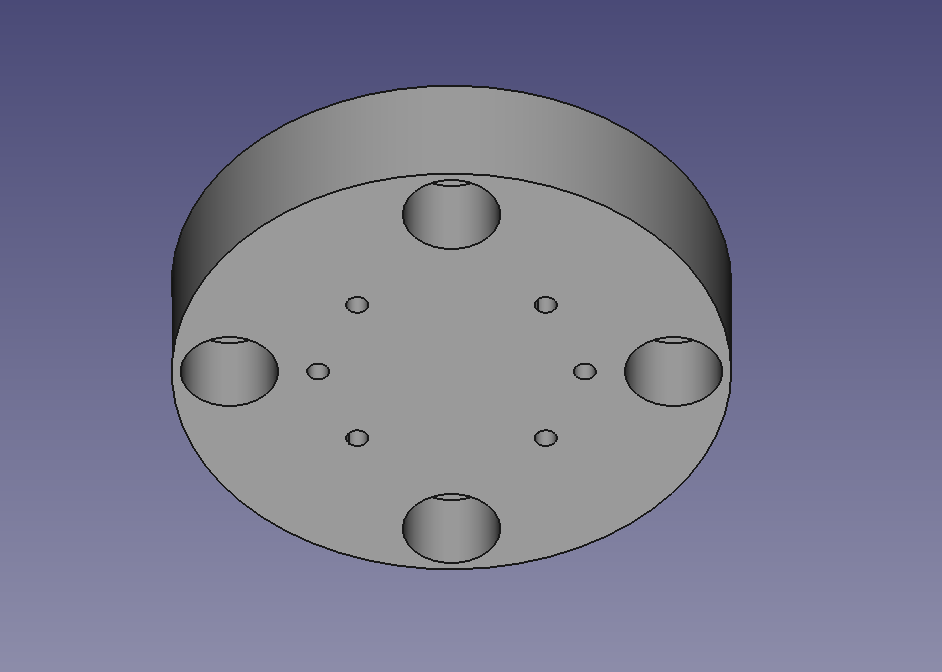
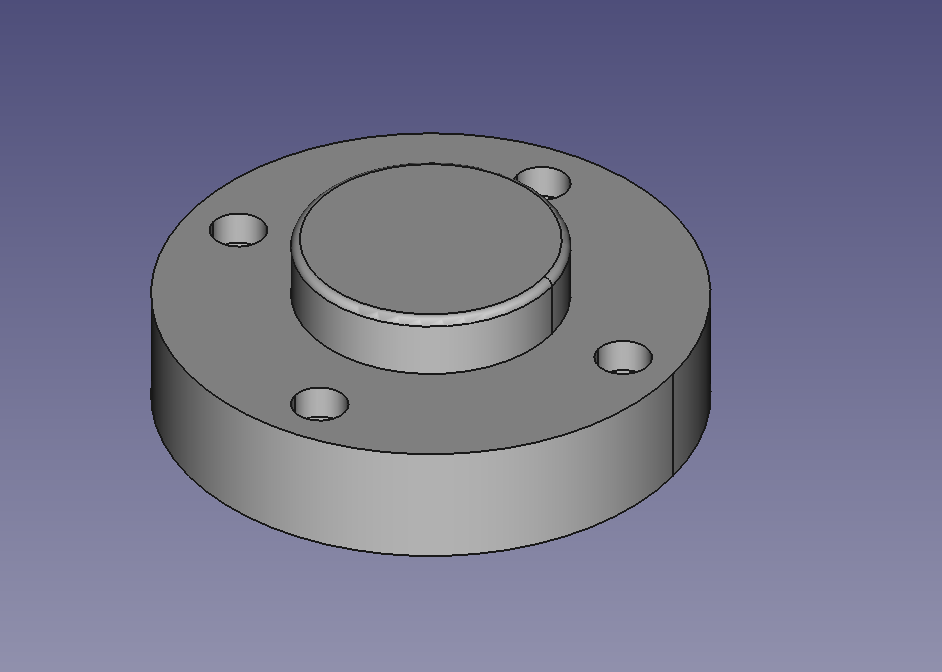
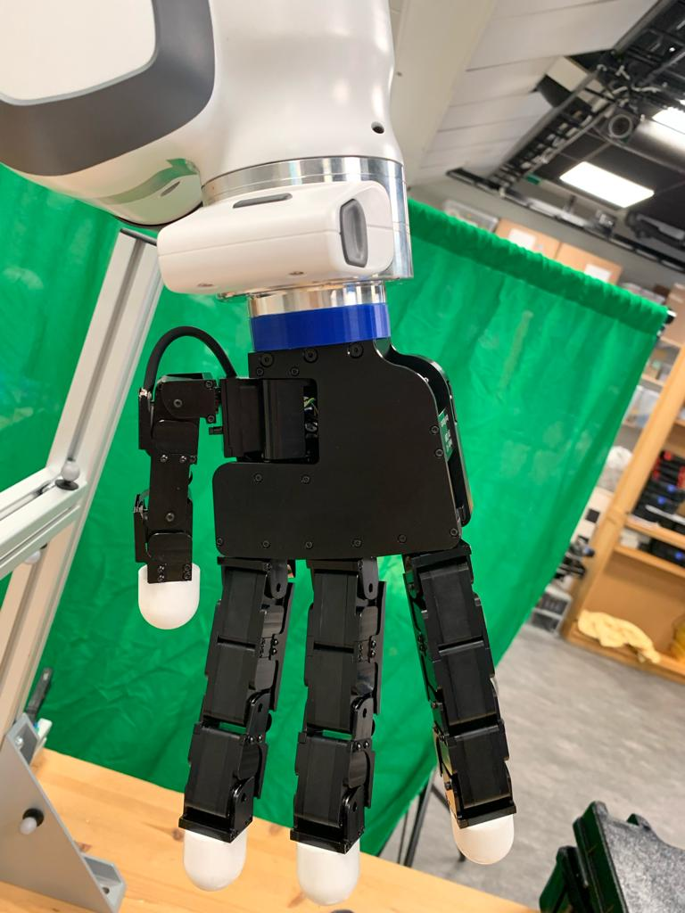

# mount_for_Allegro_hand_on_Panda_robot

This repository contains a mesh of a mount that can be used to attach an Allegro Hand version 4.0 to a Franka Panda robot. It also contains the STEP files if you want to improve the model.

Here are two images of the mesh 

Here is an image of the 3D printed mount attached to a Franka Panda robot holing an Allegro hand

